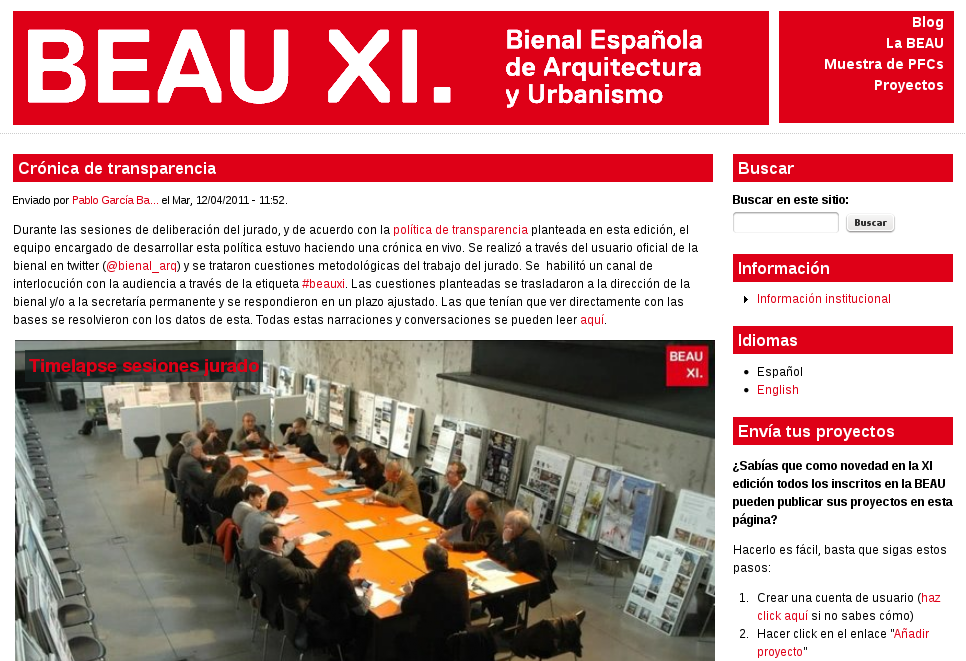

+++
title = "Web de la Bienal Española de Arquitectura y Urbanismo"
date = 2011-05-01T19:27:52+01:00
draft = false

# Tags: can be used for filtering projects.
# Example: `tags = ["machine-learning", "deep-learning"]`
tags = ["drupal", "web", "mapas"]

# Project summary to display on homepage.
summary = "Realización de web para la publicación, gestión y visualización de proyectos."

# Optional external URL for project (replaces project detail page).
external_link = ""

# Does the project detail page use math formatting?
math = false

# Does the project detail page use source code highlighting?
highlight = true

# Featured image
# Place your image in the `static/img/` folder and reference its filename below, e.g. `image = "example.jpg"`.
[header]
[image]
  placement = 3
  # Caption (optional)
  caption = "Obra ganadora de la categoría de arquitectura. Edificio de 131 viviendas protegidas en Mieres, de Bernardo Angelini y David Casino"

  # Focal point (optional)
  # Options: Smart, Center, TopLeft, Top, TopRight, Left, Right, BottomLeft, Bottom, BottomRight
  focal_point = "Top"

aliases = [
    "portfolio/web-de-la-bienal-espanola-de-arquitectura-y-urbanismo"
]
[[gallery_item]]
album = "beaxi"
image = "captura-bienal.png"
caption = "Portada"

[[gallery_item]]
album = "beauxi"
image = "xi.bienalarquitectura.es_2011-4-12_85047.png"
caption = "Mapa de obras"

[[gallery_item]]
album = "beauxi"
image = "mapa5c.png"
caption = "Mapa de obras"

[[gallery_item]]
album = "beauxi"
image = "xi.bienalarquitectura.es_2011-4-12_91017.png"
caption = "Detalle de la obra ganadora de la bienal."

[[gallery_item]]
album = "beauxi"
image = "xi.bienalarquitectura.es__equipo_0.png"
caption = "Equipo de la BEAU XI"

+++

Realización de la web oficial de la <a href="http://xi.bienalarquitectura.es" class="ext" target="_blank">XI edición de la Bienal Española de Arquitectura y Urbanismo</a>. A pesar de que el encargo era bastange genérico y sucinto, también fue lo bastante flexible como para permitirme aportar todas las ideas que creyese oportunas para conseguir dar respuesta de manera óptima a los objetivos de <strong>difusión y documentación</strong> de la información generada acerca de la Bienal.

El principal reto, a parte del poco tiempo para realizarla (inicialmente fue de apenas dos semanas), era que además de tener una plataforma donde publicar la información de la bienal y de la **relación con redes sociales** que se exigen hoy en día, fuese una herramienta que permitiese la publicación y **auto-publicación** de proyectos por parte del personal de la bienal y por parte de los propios participantes sin comprometer el rigor que exige la tarea de documentación de un evento de esta magnitud. Otro aspecto que quise explorar e incorporar fue la introducción de información geográfica en forma de **mapas**.



### Auto-publicación y documentación

Dado que en el encargo se daba mucha importancia a la labor de documentación que debía asumir la web, uno de los aspectos que iban a condicionar el éxito o el fracaso de la web era que la mayoría de los 750 proyectos presentados estuviesen publicados. Dado que era imposible contar con un número elevado de obras publicadas en el plazo de tiempo que dura la convocatoria con el personal y recursos disponibles, la única manera de conseguir el objetivo era dejando que los propios participantes publicasen las obras al mismo tiempo que facilitaban la información para participar en el premio.

Para que eso fuera posible se trabajo mucho en establecer un <strong>protocolo fácil de usar y amigable</strong>, que pasaba sobretodo por <strong>estandarizaron todos los campos</strong> en función de lo que establecían las bases y de criterios de generación de meta-información documental, garantizando la homogeneidad de los envíos así como su corrección formal. Lo que en principio era una limitación se convirtió en una oportunidad de generar en relativo poco tiempo una importante base de datos documental de obras muy interesante para los interesados en la materia.

### Geoposicionamiento

Una de las características más importantes de una obra de arquitectura es su emplazamiento, y sin embargo este suele obviarse en muchas webs de arquitectura.&nbsp; Una de mis obsesiones particulares como arquitecto y desarrollador de webs es incorporar datos de geoposicionamiento así que esta era una gran oportunidad de desarrollar algunas de las experimentaciones que había ido haciendo previamente.

No es de extrañar, pues, que el mapa de proyectos ocupe una parte importante de las páginas de proyectos. Todos los proyectos están geoposicionados a partir de unas coordenadas que se introducen a partir de la dirección, lo cual permite generar un mapa interactivo que muestre las obras premiadas, finalistas, seleccionadas y participantes en capas diferentes que pueden ser activadas o desactivadas de forma individual a voluntad del visitante. Otras interactividades destacables son la posibilidad de navegar por el <strong>mapa a pantalla completa</strong> (lo cual facilita la labor de buscar y encontrar las obras y leer su relación con el entorno), <strong>cambiar las capas de fondo</strong> o <strong>mostrar la información</strong> resumida de cada proyecto al pasar por encima de su situación.

<strong>Sistema de votación de los PFCs</strong>

Otro aspecto destacable de la web de la BEAUXI es que es también una herramienta de trabajo que permite a los miembros del jurado votar los Proyectos Finales de Carrera que se presentan a la IV Muestra de PFCs para lo cual se estableció un sistema de votaciones solo disponible para los miembros del jurado.

### Otros datos de interés:

<ul><li><strong>Integración con terceros: </strong>Facebook y Twitter tienen sendos widgets en la barra lateral que muestran, a tiempo real, la actividad generada en los canales de la BEAUXI en dichas redes sociales.</li>
<li><strong>Moderación de comentarios: </strong>como parte del proyecto de transparencia se ofrecía la posibilidad de que cualquier persona pudiese votar y comentar el contenido publicado en la web. En previsión de que pudiera hacerse un mal uso de la libertad de expresión mal entendida se integró el servicio <a href="https://disqus.com/" class="ext" target="_blank">disqus</a> como herramienta que permitiese moderar, llegado el caso, los comentarios por parte del equipo de la BEAUXI.</li>
<li><strong>Multi-idioma:</strong> el contenido y la navegación pueden estar en español e inglés.</li>
<li>Gestión de una portada común para todas las bienales que sirva para ver todas las ediciones anteriores</li>
