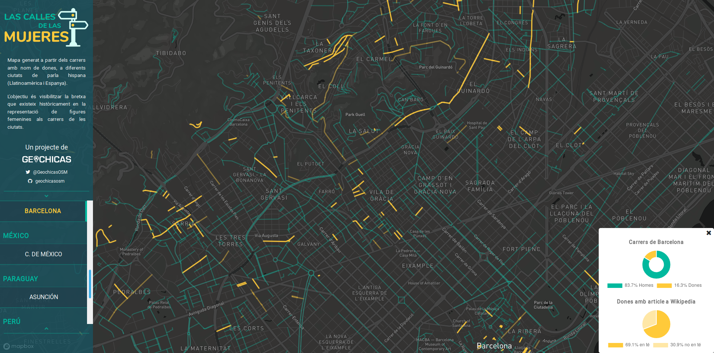

+++
title = "Un breve apunte sobre mapas y feminismo"
date = 2019-03-08T15:10:07+01:00
draft = false

# Tags and categories
# For example, use `tags = []` for no tags, or the form `tags = ["A Tag", "Another Tag"]` for one or more tags.
tags = ["mapas", "feminismo", "género"]
categories = ["General", "Reivindicaciones"]
people = ["geochicas"]
projects = [""]

# Featured image
# Place your image in the `static/img/` folder and reference its filename below, e.g. `image = "example.jpg"`.
# Use `caption` to display an image caption.
#   Markdown linking is allowed, e.g. `caption = "[Image credit](http://example.org)"`.
# Set `preview` to `false` to disable the thumbnail in listings.
[header]
[image]
# Caption (optional)
caption = "Calles dedicadas a hombres y mujeres en Barcelona. Fuente: La Calle de las mujeres, un proyecto de Geochicas."

# Focal point (optional)
# Options: Smart, Center, TopLeft, Top, TopRight, Left, Right, BottomLeft, Bottom, BottomRight
focal_point = "Smart"

[[gallery_item]]
album = "gallery"
image = "stats-barcelona.png"
caption = "Barcelona: Únicamente el 16% de las calles llevan nombre de mujer, frente al 83% de calles con nombre de hombres."

[[gallery_item]]
album = "gallery"
image = "stats-bsaires.png"
caption = "Buenos Aires: Únicamente el 6% de las calles llevan nombre de mujer, frente al 93% de calles con nombre de hombres."

+++

Como saben bien los que me conocen, [me encantan los mapas](/tags/mapas/): Me gusta verlos, me gusta hacerlos y me gusta usarlos para dar respuestas a preguntas complejas. Me gusta el hecho de que se pueden crear mapas sobre casi cualquier cosa. Pero seguramente lo que más me gusta de ellos es que **son una herramienta única para evidenciar realidades que suelen pasar desapercibidas pero que ayudan a la comprensión de fenómenos de todo tipo**. Son habituales (incluso hasta manidos) los ejemplos de mapas utilizados para explicar la propagación de enfermedades[^snow-map], la [distribución del consumo energético](https://data.worldbank.org/indicator/EG.USE.ELEC.KH.PC?view=map), la desigualdad social, o la [gentrificación](https://www.theguardian.com/cities/2016/sep/30/worlds-most-gentrified-cities-crime-stats-coffee-shops). Sin embargo, podemos hacer mapas sobre cualquier tema que se nos ocurra, y hay ejemplos no por menos conocidos dejan de ser importantes (¡al contrario!), **como el caso de la desigualdad por motivo de género**.

Es por ello que hoy, [8 de marzo, día internacional de la mujer](https://es.wikipedia.org/wiki/D%C3%ADa_Internacional_de_la_Mujer), quería destacar el excelente trabajo que han realizado desde [Geochicas](http://geochicas.org)[^geochicas], con el proyecto [Las calles de las mujeres](https://geochicasosm.github.io/lascallesdelasmujeres/).

La Calle de las mujeres es paradigmático porque hace una lectura novedosa y necesaria de una realidad muy cotidiana para la mayoría de quienes vivimos en entornos urbanos: el nomenclator de las calles. A través de identificar las calles de algunas ciudades en España y Latinoamerica cuyos nombres hacen referencia a mujeres y compararlo con las calles cuyo nombre hace referencia a un hombre evidencian que existe una gran diferencia en la representación femenina en el espacio público. El tema no es para nada trivial: dado que a menudo el nombre de las calles es una forma de celebrar (y relatar) la cultura de un lugar a través de asignar nombres a personas influyentes y notables o hitos que han marcado la historia, **una representación de género tan desigual evidencia que se silencia sistemáticamente la importancia de las mujeres, lo cual contribuye a construir un relato en el las mujeres no han tenido apenas un papel importante (o digno de ser reconocido públicamente) en el desarrollo histórico y cultural de nuestra sociedad**, lo cual es a todas luces incorrecto.



Otro aspecto en el que incide el proyecto es en mostrar cuantas de las mujeres que dan nombre a alguna calle tienen artículo en la wikipedia (sin entrar en valorar su contenido), lo cual incide que dicha brecha es doble y no es algo local de unas pocas ciudades.

Por otra parte, no puedo dejar de señalar otro aspecto que me encanta del proyecto (y por el cual felicito a [Jess](https://github.com/jessisena), que ha liderado la parte de programación) es su desarrollo en abierto: dado que [el repositorio está disponible en github](https://github.com/geochicasosm/lascallesdelasmujeres) es relativamente fácil expandir la información a otras ciudades del mundo, haciendo el proyecto aún más útil si cabe.

<iframe width="100%" height="300px" frameBorder="0" allowfullscreen src="http://umap.openstreetmap.fr/ca/map/mapa-global-internaciona-feminista-8m-2019_298894?scaleControl=false&miniMap=false&scrollWheelZoom=false&zoomControl=true&allowEdit=false&moreControl=true&searchControl=null&tilelayersControl=null&embedControl=null&datalayersControl=true&onLoadPanel=undefined&captionBar=false"></iframe>

Otros ejemplos de mapas que han tratado (aunque desde otros enfoques) la perspectiva de género son el [mapa global internacional feminista del 8M de 2019](http://umap.openstreetmap.fr/ca/map/mapa-global-internacional-feminista-8m-2019_298894#6/40.372/-2.900) (realizado también por geochicas), o los mapas de entidades feministas que existen en algunas ciudades [como el realizado por el Ayuntamiento de Barcelona](https://ajuntament.barcelona.cat/dones/es/recursos-y-actualidad/mapa-de-entidades-feministas) o los que se recogen en libros como [The Penguin Atlas of Women in the World](https://www.penguinrandomhouse.com/books/303719/the-penguin-atlas-of-women-in-the-world-by-joni-seager/9780143114512) de Joni Seager.



En otra línea, pero siempre ligado con mapas y perspectiva de género, está la iniciativa impulsada por Esther Mingot (una conocida mapeadora dentro de la comunidad de OSM España bajo el pseudónimo de [Lanxana](https://www.openstreetmap.org/user/lanxana)) para [importar a OpenStreetMap todos los centros destinados a información y cuidados para mujeres y colectivo LGBTI](https://wiki.openstreetmap.org/wiki/Import_information_and_care_points_for_women_and_LGTBI_collectives_in_Catalunya), a partir de distintos conjuntos de datos abiertos del Ayuntamiento de Barcelona y la Generalitat de Catalunya, haciendo de OSM un mapa más inclusivo y útil para estos colectivos.

Todos estos ejemplos señalan otro aspecto de los mapas que me encanta: los mapas pueden ser también herramientas de transformación social.

[^snow-map]: Es famoso (y manido) el ejemplo del mapa que hizo el Dr. John Snow en 1854 para comprender la propagación del cólera en Londres y que sirvió para afirmar que el cólera se contagiaba por aguas contaminadas en lugar de por el aire, tal y como se creía hasta entonces (Para más información sobre el mapa, remitimos a [este texto de John Mackenzie](https://www1.udel.edu/johnmack/frec682/cholera/cholera2.html) en el que explica cómo funciona el mapa y cómo reproducirlo con herramientas SIG actuales).
[^geochicas]: Geochicas es un grupo de mujeres mapeadoras de OpenStreetMap orientado a cerrar la brecha de género en dicha comunidad.
